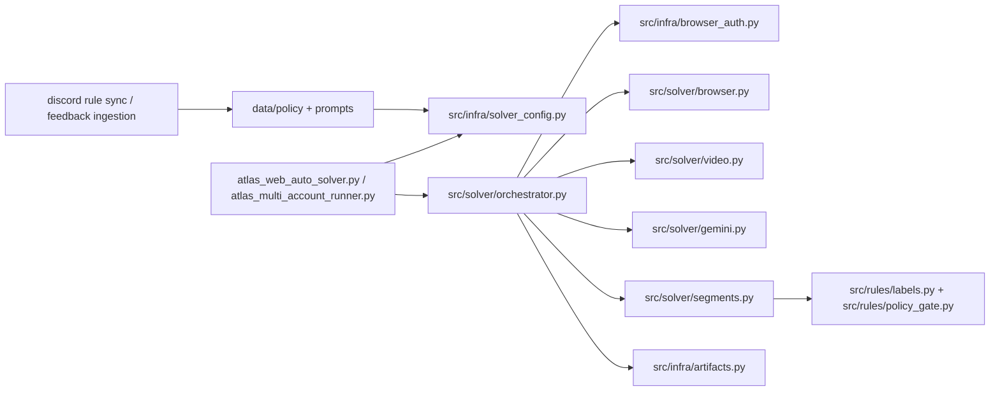

# Atlas Capture - Automated Video Labeling Pipeline

Atlas Capture is a production-grade automation system for [audit.atlascapture.io](https://audit.atlascapture.io). It logs in, reserves episodes, prepares video context, generates Gemini-powered labels, applies them, and submits work with policy gates and recovery logic. Production now targets Hetzner first, with Colab kept as a secondary fallback.

## Key Features
- Adaptive selector engine with YAML fallback chains.
- Sequential multi-account scheduler for VPS-safe execution.
- Gemini API rotation with config keys, pooled env keys, and round-robin policy.
- OTP auto-login via Gmail IMAP recovery.
- Discord-driven rule ingestion and policy synchronization.
- Hetzner-native deployment with `systemd`, health timer, and state-preserving updates.

## Project Structure
```text
.
|-- src/
|   |-- infra/                 # runtime, config, auth, shared helpers
|   |-- solver/                # CLI, scheduler, prompting, legacy implementation
|   |-- rules/                 # label rewrite and policy gate logic
|   |-- policy/                # policy context manager
|   |-- purify/                # Discord knowledge purification pipeline
|   `-- sync/                  # sync utilities
|-- configs/
|   |-- production_colab.yaml
|   |-- production_hetzner.yaml
|   `-- accounts/              # per-account server-safe overlays + scheduler index
|-- tests/                     # pytest coverage
|-- atlas_web_auto_solver.py   # stable compatibility shim
|-- atlas_multi_account_runner.py
|-- setup_hetzner_atlas.sh
|-- atlas-solver.service
|-- atlas-discord-bot.service
|-- Atlas_Colab_Runner.ipynb
`-- package_for_colab.py
```

## Architecture


Current production path:
- CLI and scheduler stay stable through [atlas_web_auto_solver.py](/E:/OCR_annotation_Atlas/atlas_web_auto_solver.py) and [atlas_multi_account_runner.py](/E:/OCR_annotation_Atlas/atlas_multi_account_runner.py).
- Active execution logic now lives in extracted modules under [src/solver](/E:/OCR_annotation_Atlas/src/solver), [src/infra](/E:/OCR_annotation_Atlas/src/infra), and [src/rules](/E:/OCR_annotation_Atlas/src/rules).
- [src/solver/legacy_impl.py](/E:/OCR_annotation_Atlas/src/solver/legacy_impl.py) remains as a compatibility layer, not the primary implementation source for the active path.

## Setup

### Local Windows
```powershell
git clone https://github.com/aymank2020/OCR_Annotation_Atlas.git
cd OCR_Annotation_Atlas
python -m venv .venv
.venv\Scripts\activate
pip install -r requirements.txt
playwright install chromium
copy .env.example .env
```

### Hetzner / Ubuntu Production
```bash
git clone https://github.com/aymank2020/OCR_Annotation_Atlas.git /srv/atlas/OCR_annotation_Atlas
cd /srv/atlas/OCR_annotation_Atlas
sudo bash setup_hetzner_atlas.sh
```

Important production files:
- `configs/production_hetzner.yaml`
- `configs/accounts/index.yaml`
- `configs/accounts/danatimer.yaml`
- `configs/accounts/wafaabayoumi.yaml`
- `configs/accounts/amirakamelkorany.yaml`
- `configs/accounts/badrbayoumi865.yaml`
- `/srv/atlas/OCR_annotation_Atlas/.env`

Secrets layout:
- `GEMINI_API_KEYS_PAID_POOL`: solver pool for `gemini-3.1-pro-preview`
- `GEMINI_API_KEY_PAID_EPISODE_EVAL`: first paid eval key
- `GEMINI_API_KEY_PAID_SECONDARY`: second paid eval key
- `GEMINI_API_KEYS_FREE_POOL`: ops pool for `gemini-3.1-pro-preview`
- `GEMINI_API_KEY_FREE_OPS` / `GEMINI_API_KEY2_FREE_OPS2`: free ops keys
- `GEMINI_API_KEY_OPS`, `GEMINI_API_KEY`, and `GOOGLE_API_KEY`: point these to an ops key for older non-scheduler tools
- Numbered Atlas scheduler accounts: `ATLAS_LOGIN_EMAIL1..4`, `ATLAS_EMAIL1..4`, `GMAIL_USER1..4`, `GMAIL_EMAIL1..4`, `GMAIL_APP_PASSWORD1..4`

Detailed server steps live in [hetzner_deployment.md](/E:/OCR_annotation_Atlas/docs/hetzner_deployment.md).

## Usage

### Single Solver CLI
```bash
python atlas_web_auto_solver.py
```

### Multi-Account Scheduler
```bash
python atlas_multi_account_runner.py --index configs/accounts/index.yaml --execute
```
Current production default:
- sequential only
- `5` tasks per account per turn
- `45s` rest between account turns

### Offline Complex Test Harness
```bash
python atlas_complex_test_harness.py --index configs/accounts/index.yaml --config configs/production_hetzner.yaml --review-index outputs/episodes_review_index.json --manual-feedback outputs/gemini_memory_sources/manual_feedback_snapshot.json --output-dir outputs/complex_test/latest --limit 20
```
This mode replays saved episode artifacts only. It does not submit anything to Atlas. It rotates episodes using the same `5 per account, then next account` logic and emits:
- `outputs/complex_test/latest/complex_test_report.json`
- `outputs/complex_test/latest/complex_test_report.md`
- `outputs/complex_test/latest/repair_queue.json`
- `outputs/complex_test/latest/repair_queue.md`

### Tests
```bash
python -m pytest tests/ -v --tb=short
```

### Server Services
```bash
sudo systemctl start atlas-solver.service
sudo systemctl start atlas-discord-bot.service
sudo systemctl start atlas-command-hub.service   # on-demand only
```

### One-Click Production On Hetzner
```bash
cd /srv/atlas/OCR_annotation_Atlas
sudo bash start_production_cycle.sh
```

Useful helpers:
```bash
sudo bash production_status.sh
sudo bash stop_production_cycle.sh
```

Optional:
- `sudo bash start_production_cycle.sh --no-solver`
  Starts the timers, monitor, and Discord bot but leaves the solver stopped.
- `sudo bash start_production_cycle.sh --no-bot`
  Starts production without the Discord bot.
- `sudo env START_SOLVER=0 bash start_production_cycle.sh`
  Legacy env-based equivalent of `--no-solver` if you prefer env overrides.
- By default, `start_production_cycle.sh` rotates `solver_service.log`, `production_monitor.log`, and `discord_bot_service.log` into `outputs/archive/` so a fresh production start begins with clean logs and clean alerts.
- `STOP_BOT=1 sudo bash stop_production_cycle.sh`
  Stops both solver and Discord bot.

Recommended monitor install:
```bash
sudo bash install_production_monitor_timer.sh
```

The production monitor:
- writes `outputs/production_monitor/last_snapshot.json`
- detects common blockers from service status and solver logs
- flags submitted episodes that still do not appear in review/feedback outputs after a delay
- can send Telegram alerts using `TELEGRAM_BOT_TOKEN` and `TELEGRAM_ALLOWED_CHATS`
- can auto-restart `atlas-solver.service` only when `.state/production_enabled.flag` exists

### Health Snapshot
```bash
python atlas_health_snapshot.py --app-dir . --index configs/accounts/index.yaml
```
This writes:
- `outputs/health_snapshot.json`

Typical Hetzner usage:
```bash
cd /srv/atlas/OCR_annotation_Atlas
.venv/bin/python atlas_health_snapshot.py --app-dir /srv/atlas/OCR_annotation_Atlas --index configs/accounts/index.yaml
```
The snapshot summarizes:
- enabled accounts in the current scheduler rotation
- `tasks_per_account_per_turn` and cooldown
- service states for solver, bot, health timer, review timer, and drive uploader
- freshness of key output artifacts such as solver logs and review index

### Prometheus Metrics Export
```bash
python atlas_prometheus_snapshot.py --app-dir . --index configs/accounts/index.yaml
```
This writes:
- `outputs/health_snapshot.json`
- `outputs/health_snapshot.prom`

The Prometheus export includes:
- scheduler gauges such as enabled accounts, tasks per turn, and cooldown
- service active/enabled gauges for solver, bot, and timers
- output artifact freshness gauges for solver log, dashboard, and review index

Discord command tips:
- `status!` returns the latest bot, rule-sync, feedback, and review-index snapshot.
- `sync!` triggers the full project sync.
- `rule: ...` and `correction: ...` append manual governance notes before syncing.

### Episode Comparison Refresh
```bash
bash run_episode_review_refresh.sh
sudo bash install_episode_review_refresh_timer.sh
```
This rebuilds:
- `outputs/episodes_review_index.json`
- `outputs/atlas_review_viewer.html`
- `outputs/atlas_os_dashboard.html`

## Hetzner Deployment
1. Bootstrap the server with `sudo bash setup_hetzner_atlas.sh`.
2. Fill `.env` with Gemini, Atlas, Gmail, and Discord secrets.
3. Copy any saved storage state JSON files into `.state/accounts/<account>/atlas_auth.json`.
4. Verify `configs/accounts/index.yaml`.
5. Start `atlas-solver.service` and `atlas-discord-bot.service`.
6. Keep `atlas-command-hub.service` disabled unless you need it through SSH tunneling.

### Google Drive Upload Remote
- The current Google Drive destination folder is `1kLe9Ai7swxh9Nx2NifD9Fcodf85AfyAG`.
- Atlas uploader scripts assume `rclone` remote name `gdrive`.
- Before each upload pass, Atlas now groups old episode artifacts into `outputs/<account>/episodes/<episode_id>/...` so Google Drive keeps every episode in its own folder instead of a flat file list.
- To migrate older flat Drive files that were uploaded before this layout, run:
  `python atlas_drive_episode_migrate.py --remote gdrive:OCR_annotation_Atlas/vps_outputs --subdir danatimer --apply`
- If storage moved to a new Google account, re-auth the remote with:
  `powershell -ExecutionPolicy Bypass -File .\reconnect_gdrive_remote.ps1`
- This reconnects the local `gdrive` remote, validates quota, and copies the same `rclone.conf` to Hetzner so VPS uploads use the same account.
- Important: transferring ownership of a folder alone is not enough. The authenticated uploader account itself must be the new high-quota account, otherwise uploads still count against the old account quota.

## Colab Deployment
1. Build the package locally with `python package_for_colab.py`.
2. Upload `Atlas_Project_Colab.zip` and `Atlas_Colab_Runner.ipynb` to Google Drive.
3. Run notebook Step 1 to unpack the package and install dependencies.
4. Run Step 2 to sync to `origin/main`.
5. Add Colab secrets.
6. Run Step 3 to execute `python atlas_web_auto_solver.py --execute --config configs/production_colab.yaml`.

## Security
- `.env` is never committed.
- Gemini key rotation reads from `.env` or server environment, not from Git.
- The command hub is bound to `127.0.0.1` only.
- Runtime state is preserved with `safe_update_preserve_local.sh`.

### Safe Secret Sync To Hetzner
Update secrets locally in `.env`, then sync them over SSH:
```powershell
powershell -ExecutionPolicy Bypass -File .\sync_env_to_hetzner.ps1 -ServerHost root@167.235.253.229
```
This uploads only the ignored `.env` file to `/srv/atlas/OCR_annotation_Atlas/.env`, fixes permissions to `600`, and optionally restarts services.

## Test Coverage
| Module | Coverage Focus |
|--------|----------------|
| `test_validator.py` | policy rules, overlap detection, label guards |
| `test_atlas_web_auto_solver.py` | solver compatibility helpers |
| `test_solver_refactor_contract.py` | shim exports and notebook packaging contracts |
| `test_hetzner_scheduler.py` | key rotation, Linux-safe scheduler behavior |
| `test_package_for_colab.py` | package filtering and required artifacts |
| additional suites | config, models, logging, streaming, policy context, resilience |

---
*Operation Phoenix Atlas - 2026*
