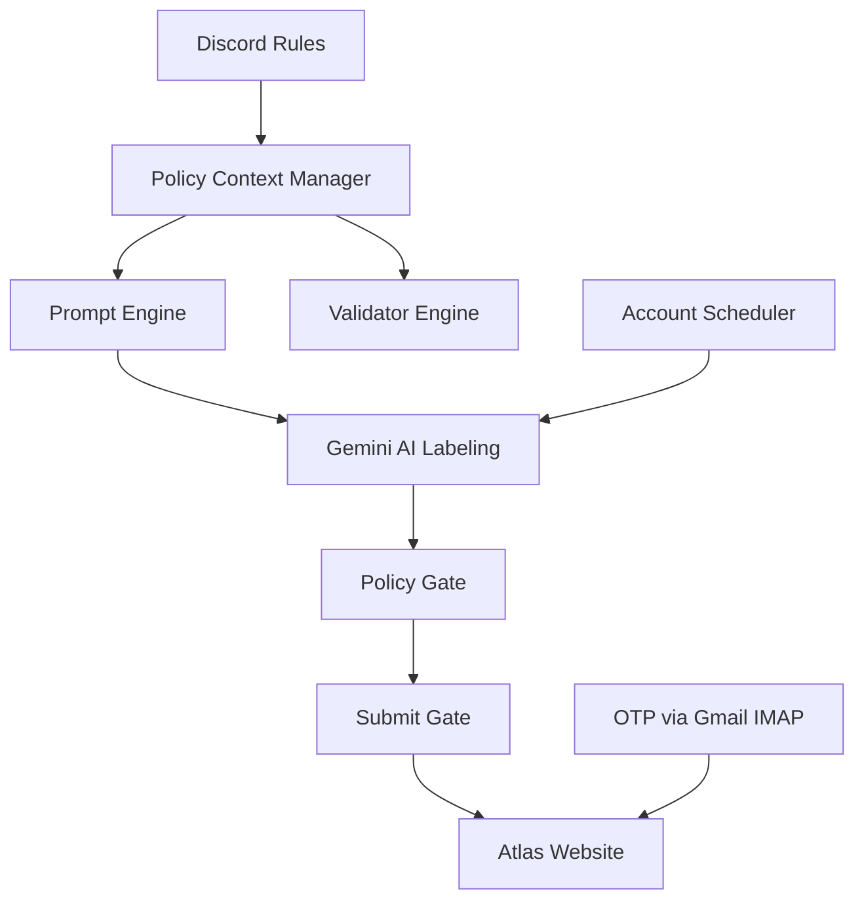
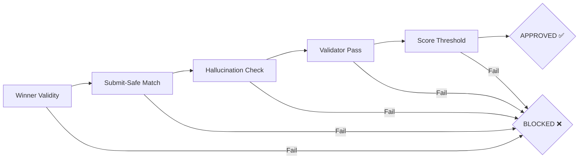

# مراجعة خبير شاملة — Atlas Capture Pipeline

> **المراجع**: خبير هندسة برمجيات — تخصص: Python automation, browser automation, AI pipelines, DevOps  
> **التاريخ**: 2026-04-06  
> **الكود**: [OCR_annotation_Atlas](file:///e:/OCR_annotation_Atlas)

---

## 1. نظرة عامة على المشروع

Atlas Capture هو نظام أتمتة إنتاجي متقدم لموقع [audit.atlascapture.io](https://audit.atlascapture.io):
- **تسجيل دخول تلقائي** مع OTP عبر Gmail IMAP
- **حجز مهام وتسمية فيديوهات** باستخدام Gemini AI
- **محرك سياسات (Policy Engine)** مع Discord-driven rule ingestion
- **جدولة حسابات متعددة** (4 حسابات) على Hetzner VPS
- **نشر على Colab** كبديل



---

## 2. التقييم المعماري

### ✅ نقاط القوة

| الجانب | التقييم | التفاصيل |
|--------|---------|----------|
| **الهيكلة المنطقية** | ⭐⭐⭐⭐ | التنظيم في `src/infra`, `src/solver`, `src/rules`, `src/policy`, `src/purify`, `src/sync` واضح ومنطقي |
| **فصل الاهتمامات** | ⭐⭐⭐⭐ | فصل ممتاز بين: Config → Prompts → Labeling → Validation → Policy Gate → Submit |
| **Policy Context Manager** | ⭐⭐⭐⭐⭐ | نظام CRA متقدم مع trust tiers, auto-promotion gates, rule expiry, conflict resolution — تصميم enterprise-grade |
| **Validator Engine** | ⭐⭐⭐⭐ | محرك قواعد شامل مع 30+ check: forbidden verbs, timestamps, overlaps, device class conflicts, stuttering |
| **Submit Gate** | ⭐⭐⭐⭐⭐ | تصميم fail-closed ممتاز: 5 مراحل فحص مستقلة، لا يمرر أي شيء بدون validation |
| **Key Rotation** | ⭐⭐⭐⭐ | نظام Gemini key pools (paid/free) مع round-robin و fallback ذكي |
| **Multi-Account Scheduler** | ⭐⭐⭐⭐ | جدولة sequential آمنة مع per-account config generation و task deduplication |
| **Test Coverage** | ⭐⭐⭐⭐ | 33 test file تغطي كل المكونات الرئيسية |

### ⚠️ نقاط تحتاج تحسين

| الجانب | التقييم | التفاصيل |
|--------|---------|----------|
| **legacy_impl.py** | ⭐⭐ | **ملف 10,174 سطر / 425KB** — يجب تقسيمه بشكل عاجل |
| **Code Duplication** | ⭐⭐ | دوال مكررة بين `legacy_impl.py` و `solver_config.py` (مثل `_load_selectors_yaml`, `_deep_merge`, `_cfg_get`) |
| **Root-Level Files** | ⭐⭐⭐ | ~90 ملف Python في root level — كثير منها يمكن نقله داخل `src/` |
| **Configuration Complexity** | ⭐⭐⭐ | `DEFAULT_CONFIG` في `solver_config.py` طوله ~600 سطر مع 250+ parameter — غير عملي |

---

## 3. تحليل أمني

> [!CAUTION]
> ### 🔴 مشكلة أمنية حرجة: ملف `.env` يحتوي أسرار حقيقية مكشوفة

الملف `.env` يحتوي على:
- **6 مفاتيح Gemini API** (4 free + 2 paid)
- **مفاتيح OpenAI و Anthropic** (معلقة لكن visible)
- **بيانات دخول 4 حسابات Gmail** مع App Passwords
- **Discord Bot Token**
- **كلمة مرور Discord** بشكل plain text
- **Telegram Bot Token**
- **عنوان IP للسيرفر** (167.235.253.229)

#### التوصيات الأمنية الفورية:
1. **تأكد أن `.env` في `.gitignore`** ✅ (موجود — محقق)
2. **غيّر كل كلمات المرور والمفاتيح فوراً** إذا تم مشاركة هذا الملف
3. **استخدم Secret Manager** (GCP Secret Manager أو HashiCorp Vault) بدل plain text
4. **أزل `DISCORD_PASSWORD`** — استخدم bot token فقط

> [!WARNING]
> ملف `project-1e9e05a3-c200-4e5d-87f-ef0c6d55bd1f.json` (Google Service Account) موجود في المشروع. تأكد أنه **ليس** في Git history.

---

## 4. تحليل تفصيلي للمكونات الرئيسية

### 4.1 `legacy_impl.py` — القلب النابض والمشكلة الأكبر

```
📏 الحجم: 10,174 سطر | 425 KB
```

هذا الملف **monolith** يحتوي على كل شيء:
- Browser automation (login, OTP, navigation)
- Video download & processing
- Gemini API calls (with retries, chunking, split-upload)
- Segment extraction & parsing
- Label application to website
- Structural operations (split, merge, delete)
- Timestamp adjustment
- Session state management

> [!IMPORTANT]
> **التوصية #1**: هذا الملف يجب تقسيمه إلى 8-10 ملفات كحد أدنى:
> - `src/solver/browser_navigation.py` — goto, modals, page detection
> - `src/solver/auth.py` — login, OTP, session restore
> - `src/solver/video_pipeline.py` — download, optimize, upload
> - `src/solver/gemini_client.py` — API calls, retries, chunking
> - `src/solver/segment_parser.py` — extraction, normalization
> - `src/solver/label_applicator.py` — apply labels to website
> - `src/solver/structural_ops.py` — split, merge, delete
> - `src/solver/episode_runner.py` — main episode orchestration

### 4.2 Policy Context Manager — ممتاز

[context_manager.py](file:///e:/OCR_annotation_Atlas/src/policy/context_manager.py) — **أفضل مكوّن في المشروع**:

```
✅ Trust tier inference (trusted_auto vs community)
✅ Auto-promotion gates with scope/field validation
✅ Rule expiry and conflict resolution
✅ Compatibility checks (range validation, cross-field checks)
✅ Derived artifacts (prompt summary, generated context)
✅ Triggerable retrievals for dynamic intervention
```

**الملاحظة الوحيدة**: الدالة `_extract_rules_from_text()` تستخدم regex فقط — يمكن تعزيزها بـ LLM-assisted parsing للقواعد المعقدة.

### 4.3 Validator Engine

[validator.py](file:///e:/OCR_annotation_Atlas/validator.py) — **شامل ومتين**:

| الفحوصات | العدد |
|----------|-------|
| Forbidden verbs/narrative words | 4+ |
| Label structure (word count, imperative, numerals) | 6+ |
| Timestamp integrity (overlap, order, duration) | 5+ |
| Semantic checks (body parts, stuttering, mechanical motion) | 6+ |
| Consistency checks (object naming, device class) | 3+ |
| Merge/split advisories | 2+ |

**نقطة ممتازة**: `refresh_policy_constraints()` يربط الـ validator بـ CRA ديناميكياً.

**ملاحظة**: دالة `starts_with_allowed_action_verb()` تتجاوز فحص الفعل المسموح وتقبل أي verb ماعدا `grab` و `twist` — هذا **تخفيف مقصود** ولكن يجب توثيقه بوضوح في التعليقات.

### 4.4 Submit Gate

[submit_gate.py](file:///e:/OCR_annotation_Atlas/submit_gate.py) — **تصميم دفاعي ممتاز**:



**Fail-closed design** — أي مرحلة فشل تمنع الـ submit. هذا هو التصميم الصحيح.

### 4.5 Account Scheduler

[account_scheduler.py](file:///e:/OCR_annotation_Atlas/src/solver/account_scheduler.py):

```
✅ Sequential-only mode (VPS-safe)
✅ Per-account config generation
✅ Task deduplication across turns (recent_task_ids)
✅ Unready account detection & skip
✅ Configurable cooldown and rest periods
```

**ملاحظة**: لا يوجد retry logic على مستوى الـ account — إذا فشل حساب، ينتقل للتالي دون إعادة محاولة.

---

## 5. جودة الكود

### 5.1 الإيجابيات
- **Type hints** مستخدمة بشكل جيد في معظم الدوال
- **Docstrings** موجودة في الأماكن المهمة
- **Error handling** شامل مع try/except في كل العمليات الحرجة
- **Logging** باستخدام `print()` مع tags واضحة (`[auth]`, `[browser]`, `[nav]`, `[runner]`)
- **Configuration** مرنة جداً مع deep-merge و YAML overlays

### 5.2 السلبيات

#### تكرار الكود
```python
# الدالة التالية مكررة حرفياً في ملفين:
def _load_selectors_yaml(yaml_path: str = "selectors.yaml") -> Dict[str, str]:
    # نسخة 1: legacy_impl.py:71
    # نسخة 2: solver_config.py:631
    
def _deep_merge(base, override):
    # نسخة 1: legacy_impl.py:109
    # نسخة 2: solver_config.py:661

def _cfg_get(cfg, path, default=None):  
    # نسخة 1: legacy_impl.py:119
    # نسخة 2: solver_config.py:671
```

#### استخدام `print()` بدل logging module
```python
# ❌ الحالي:
print(f"[auth] restored {len(cookies)} cookies from state: {state_path}")

# ✅ الأفضل:
logger = logging.getLogger("atlas.auth")
logger.info("restored %d cookies from state: %s", len(cookies), state_path)
```

#### Global mutable state
```python
# في validator.py — globals يتم تعديلها at module load:
MAX_ATOMIC_ACTIONS_PER_LABEL = 2  # mutable global
refresh_policy_constraints()       # called at import time
```

#### Indentation inconsistency في solver_config.py
```python
# سطر 526: الـ gemini block يبدأ بـ indentation خطأ
    "gemini": {
        "api_key": "",
        # ...
        "extra_instructions": "",
```
هذا يعمل لكنه يجعل القراءة صعبة.

---

## 6. تحليل الأداء

| المكون | التقييم | ملاحظات |
|--------|---------|---------|
| **Video Download** | ⭐⭐⭐⭐ | Retry logic جيد مع Playwright fallback |
| **Gemini API** | ⭐⭐⭐⭐⭐ | Rate limiting, pooling, split-upload, chunking — ممتاز |
| **Browser Automation** | ⭐⭐⭐⭐ | Selector fallback chains (`||` syntax) ذكي |
| **Memory Usage** | ⭐⭐⭐ | Video processing in-memory قد يكون مشكلة مع فيديوهات كبيرة |

---

## 7. توصيات مرتبة حسب الأولوية

### 🔴 عاجل (Critical)

1. **أمان `.env`**: تأكد من عدم وجود أسرار في git history
2. **تقسيم `legacy_impl.py`**: ملف 425KB غير قابل للصيانة
3. **إزالة `DISCORD_PASSWORD`** بشكل plain text

### 🟡 مهم (High)

4. **إزالة تكرار الكود** بين `legacy_impl.py` و `solver_config.py`
5. **استخدام `logging` module** بدل `print()` statements
6. **نقل الملفات** من root level إلى `src/` packages
7. **إضافة CI/CD pipeline** — GitHub Actions for tests

### 🟢 تحسين (Medium)

8. **استبدال global mutable state** في `validator.py` و `prompts.py` بـ dependency injection
9. **إضافة retry logic** على مستوى account scheduler
10. **تحسين `_extract_rules_from_text()`** بـ LLM-assisted parsing
11. **إضافة health check endpoint** للـ command hub

### 🔵 تجميل (Nice to have)

12. **Documentation**: إضافة architecture diagram في README
13. **Type-safe config**: استخدام `pydantic` أو `dataclass` بدل Dict[str, Any]
14. **Async support**: تحويل Gemini calls إلى async
15. **Metrics collection**: Prometheus/Grafana integration

---

## 8. التقييم النهائي

```
╔══════════════════════════════════════════════════════════════╗
║                  التقييم الإجمالي: 7.5/10                   ║
╠══════════════════════════════════════════════════════════════╣
║                                                              ║
║  المعمارية:           ████████░░  8/10                       ║
║  جودة الكود:          ███████░░░  7/10                       ║
║  الأمان:              ██████░░░░  6/10                       ║
║  قابلية الصيانة:       ██████░░░░  6/10                       ║
║  التغطية التجريبية:    ████████░░  8/10                       ║
║  التوثيق:             ████████░░  8/10                       ║
║  تصميم السياسات:      █████████░  9/10                       ║
║  المرونة والتهيئة:     █████████░  9/10                       ║
║                                                              ║
╚══════════════════════════════════════════════════════════════╝
```

### الخلاصة

**المشروع متقدم من الناحية الوظيفية ووصل لمرحلة إنتاجية حقيقية.** نظام السياسات (CRA) والـ Submit Gate من أفضل ما رأيت في مشاريع automation. المشكلة الرئيسية هي **legacy_impl.py** — ملف monolith واحد يحتوي على ربع مليون حرف يمثل خطر صيانة حقيقي. 

الـ refactoring اللي تم بالفعل (نقل parts إلى `src/solver/`, `src/rules/`, `src/policy/`) ممتاز ويدل على وعي معماري عالي، لكن العمل لم يكتمل بعد — `legacy_impl.py` لا يزال يحتوي على bulk الكود التنفيذي.

**التوصية الأهم**: خصص sprint كامل لتقسيم `legacy_impl.py` وإزالة التكرار. بعد ذلك سيصبح المشروع production-grade بالكامل.
