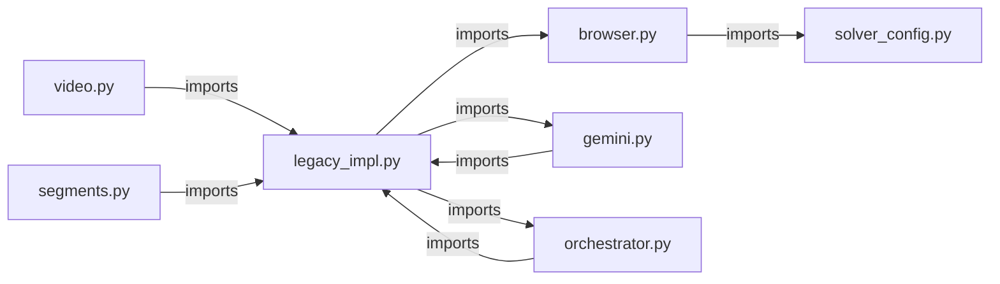

# مراجعة ما بعد التنفيذ — Atlas Capture Pipeline

> **المراجع**: Claude Opus 4.6 (Thinking) — تدقيق ما بعد تنفيذ التوصيات  
> **التاريخ**: 2026-04-06  
> **المرجع**: [atlas_expert_review.md](file:///e:/OCR_annotation_Atlas/atlas_expert_review.md)  
> **آخر 12 commit**: استخراج وحدات من legacy_impl.py

---

## ملخص تنفيذي

تم تنفيذ **جهد refactoring كبير** منذ المراجعة الأصلية: تم تقسيم `legacy_impl.py` من **10,174 سطر** إلى **5,216 سطر** (تخفيض 49%)، وتم استخراج 10+ وحدات جديدة، وإضافة CI/CD pipeline. لكن هناك **3 مشاكل جوهرية لم تُحل** وواحدة جديدة ظهرت أثناء التنفيذ.

```
╔══════════════════════════════════════════════════════════════════╗
║              حالة التوصيات: 4/15 مكتمل ✅                       ║
║                            3/15 جزئي ⚠️                        ║
║                            8/15 لم تُنفذ ❌                     ║
╚══════════════════════════════════════════════════════════════════╝
```

---

## 1. تقييم التوصيات الحرجة (🔴 Critical)

### التوصية #1: أمان `.env` — ⚠️ جزئي

| الفحص | النتيجة |
|-------|---------|
| `.env` في `.gitignore` | ✅ موجود (`.env` و `.env.*`) |
| `project-*.json` في `.gitignore` | ✅ موجود |
| لا أسرار في Git history | ✅ لم يتم العثور على أي commit يحتوي `.env` أو ملف SA |
| Secret Manager بدل plain text | ❌ لا يزال plain text |

> [!CAUTION]
> **`DISCORD_PASSWORD` لا يزال مكشوفاً** بالسطر 82 في `.env`:
> ```
> DISCORD_PASSWORD='Ayman@123456*'
> ```
> هذا خطر أمني حقيقي. يجب إزالته فوراً واستخدام bot token فقط.

---

### التوصية #2: تقسيم `legacy_impl.py` — ⚠️ جزئي (تقدم كبير)

#### ما تم إنجازه:

تم استخراج **10 وحدات** جديدة بنجاح:

| الوحدة الجديدة | الحجم | المسؤولية |
|---------------|-------|-----------|
| [browser.py](file:///e:/OCR_annotation_Atlas/src/solver/browser.py) | 972 سطر | Navigation, selectors, modals, reserve |
| [gemini.py](file:///e:/OCR_annotation_Atlas/src/solver/gemini.py) | 1,521 سطر | API calls, upload, rate limiting, quota |
| [segments.py](file:///e:/OCR_annotation_Atlas/src/solver/segments.py) | 1,378 سطر | Extraction, apply labels, submit |
| [orchestrator.py](file:///e:/OCR_annotation_Atlas/src/solver/orchestrator.py) | 400 سطر | Policy gate, compare, run loop |
| [video.py](file:///e:/OCR_annotation_Atlas/src/solver/video.py) | 359 سطر | Video acquisition, preprocessing |
| [prompting.py](file:///e:/OCR_annotation_Atlas/src/solver/prompting.py) | ~500 سطر | Prompt building |
| [artifacts.py](file:///e:/OCR_annotation_Atlas/src/infra/artifacts.py) | ~300 سطر | Task-scoped file management |
| [browser_auth.py](file:///e:/OCR_annotation_Atlas/src/infra/browser_auth.py) | ~700 سطر | Login, OTP, session restore |
| [runtime.py](file:///e:/OCR_annotation_Atlas/src/infra/runtime.py) | ~60 سطر | Graceful shutdown |
| [utils.py](file:///e:/OCR_annotation_Atlas/src/infra/utils.py) | ~15 سطر | Shared helpers |

**حجم `legacy_impl.py`**: 10,174 → **5,216 سطر** (237 KB) — تخفيض **49%**

#### ✅ نقاط إيجابية في الاستخراج:

- **كل وحدة لها docstring** واضح ومحدد المسؤولية
- **التنظيم المنطقي** ممتاز: `src/infra/` للبنية التحتية، `src/solver/` للمنطق
- **اختبارات Refactoring** مخصصة: [test_refactored_module_sources.py](file:///e:/OCR_annotation_Atlas/tests/test_refactored_module_sources.py) و [test_solver_refactor_contract.py](file:///e:/OCR_annotation_Atlas/tests/test_solver_refactor_contract.py)

> [!WARNING]
> ### 🆕 مشكلة: نمط Facade Anti-Pattern
>
> الوحدة `video.py` **لا تحتوي على الكود الفعلي** — بل تُعيد تصدير 20+ دالة من `legacy_impl.py`:
> ```python
> # video.py — سطور 17-37
> _looks_like_video_url = _legacy._looks_like_video_url
> _collect_video_url_candidates = _legacy._collect_video_url_candidates
> _download_video_via_playwright_request = _legacy._download_video_via_playwright_request
> _is_probably_mp4 = _legacy._is_probably_mp4
> # ... 16 دالة أخرى بنفس النمط
> ```
>
> **المشكلة**: الكود الفعلي لا يزال في `legacy_impl.py` (سطور 171-716+). الوحدات الجديدة مجرد **واجهات (facades)** تُعيد التصدير. هذا يعني:
> 1. حجم `legacy_impl.py` الحقيقي أكبر مما يبدو
> 2. سلسلة imports هشة: `video.py → legacy_impl → browser.py` 
> 3. لا فائدة من الفصل إذا لم يُنقل الكود فعلياً

> كذلك `legacy_impl.py` نفسه يحتوي على 130+ سطر aliases في الأعلى (سطور 59-132):
> ```python
> _load_selectors_yaml = _solver_config._load_selectors_yaml
> _deep_merge = _solver_config._deep_merge
> _cfg_get = _solver_config._cfg_get
> # ... 70+ alias آخر
> ```

**التوصية**: نقل الدوال الفعلية (implementations) من `legacy_impl.py` إلى الوحدات المناسبة، وليس مجرد إعادة التصدير.

---

### التوصية #3: إزالة `DISCORD_PASSWORD` — ❌ لم تُنفذ

> [!CAUTION]
> كلمة المرور لا تزال موجودة بالنص الصريح:
> ```
> .env:82  DISCORD_PASSWORD='Ayman@123456*'
> ```

---

## 2. تقييم التوصيات المهمة (🟡 High)

### التوصية #4: إزالة تكرار الكود — ✅ مكتمل

| قبل | بعد |
|-----|-----|
| `_load_selectors_yaml` مكرر في ملفين | مركزي في `src/infra/solver_config.py` |
| `_deep_merge` مكرر في ملفين | مركزي في `src/infra/solver_config.py` |
| `_cfg_get` مكرر في ملفين | مركزي في `src/infra/solver_config.py` |

`legacy_impl.py` الآن يستورد من `_solver_config` بدلاً من تعريف نسخ محلية. ✅

---

### التوصية #5: استخدام `logging` module — ❌ لم تُنفذ

```
عدد print() في src/solver/legacy_impl.py: 173
عدد import logging في src/solver/*: 0
```

**كل** الوحدات المستخرجة حديثاً تستخدم `print()` حصرياً:
- `browser.py`: `print(f"[atlas] ...")`
- `gemini.py`: `print(f"[gemini] ...")`
- `video.py`: `print(f"[video] ...")`
- `segments.py`: `print(f"[run] ...")`
- `orchestrator.py`: `print(f"[policy] ...")`

لم يتم أي تحول نحو `logging` module.

---

### التوصية #6: نقل الملفات من root إلى `src/` — ❌ لم تُنفذ

```
عدد ملفات Python في root: 75
```

الملفات الرئيسية لا تزال في root level:
- `validator.py` (45 KB)
- `prompts.py` (21 KB)
- `submit_gate.py` (19 KB)
- `pipeline_runner.py` (43 KB)
- `atlas_command_hub.py` (24 KB)
- و 70+ ملف آخر

---

### التوصية #7: GitHub Actions CI/CD — ✅ مكتمل

تم إنشاء [ci.yml](file:///e:/OCR_annotation_Atlas/.github/workflows/ci.yml) يتضمن:

```yaml
✅ Test Suite: pytest tests/ -v --tb=short -x
✅ Secrets Check: يفحص عدم وجود .env في الملفات المتتبعة
✅ Syntax Check: py_compile للوحدات الرئيسية  
✅ Pip Caching: actions/cache@v4
✅ CI env variables: placeholder keys لبيئة الاختبار
```

> [!NOTE]
> ملاحظة طفيفة: خطوة Lint تشير إلى مسارات `data/atlas/...` — تأكد أن هذه الملفات موجودة فعلاً في المشروع.

---

## 3. تقييم التوصيات المتوسطة (🟢 Medium)

### التوصية #8: استبدال global mutable state — ❌ لم تُنفذ

```python
# validator.py — لا يزال كما هو:
MAX_ATOMIC_ACTIONS_PER_LABEL = 2    # global mutable
refresh_policy_constraints()         # called at import time (line 253)
```

**تحسين طفيف**: تم إضافة docstring لدالة `starts_with_allowed_action_verb()` (سطور 374-382) توضح أن التخفيف مقصود — وهذا يعالج ملاحظة المراجعة بشأن التوثيق.

### التوصية #9: Retry logic في Account Scheduler — ❌ لم تُنفذ

### التوصية #10: LLM-assisted rule parsing — ❌ لم تُنفذ

### التوصية #11: Health check endpoint — ❌ لم تُنفذ

---

## 4. تقييم التوصيات التجميلية (🔵 Nice to have)

| # | التوصية | الحالة |
|---|---------|--------|
| 12 | Architecture diagram في README | ❌ |
| 13 | Pydantic/dataclass config | ❌ |
| 14 | Async Gemini | ❌ |
| 15 | Metrics (Prometheus) | ❌ |

---

## 5. ملاحظات جديدة (لم تكن في المراجعة الأصلية)

### 🆕 5.1 سلاسل Imports الدائرية



`orchestrator.py` و `gemini.py` يستوردان من `legacy_impl` عبر `import_module()` (lazy import) لتجنب circular imports:
```python
# orchestrator.py:28
legacy = import_module("src.solver.legacy_impl")
```
هذا حل مقبول مؤقتاً لكنه يُخفي التبعيات ويصعّب اكتشاف الأخطاء.

### 🆕 5.2 تغطية الاختبارات ممتازة

- **33 ملف اختبار** تغطي المكونات الرئيسية
- ملفات اختبار مخصصة للـ refactoring:
  - `test_refactored_module_sources.py` (33 KB) — يتحقق أن الوحدات المستخرجة تعمل
  - `test_solver_refactor_contract.py` (3.3 KB) — يتحقق من عقود الاستيراد

### 🆕 5.3 ملف Service Account

```
project-1e9e05a3-c200-4e5d-87f-ef0c6d55bd1f.json
```
- ✅ مضاف في `.gitignore` عبر `project-*.json`
- ✅ لا يظهر في Git history
- ⚠️ لكنه موجود فعلياً على القرص — تأكد أنه لا يتم نسخه عن طريق الخطأ

---

## 6. التقييم المحدّث

```
╔══════════════════════════════════════════════════════════════════╗
║              التقييم المحدّث بعد الـ Refactoring                ║
╠══════════════════════════════════════════════════════════════════╣
║                                    قبل        بعد              ║
║  المعمارية:           ████████░░  8/10  →  ████████▒░  8.5/10  ║
║  جودة الكود:          ███████░░░  7/10  →  ███████▒░░  7.5/10  ║
║  الأمان:              ██████░░░░  6/10  →  ██████▒░░░  6.5/10  ║
║  قابلية الصيانة:       ██████░░░░  6/10  →  ███████░░░  7/10    ║
║  التغطية التجريبية:    ████████░░  8/10  →  █████████░  8.5/10  ║
║  التوثيق:             ████████░░  8/10  →  ████████░░  8/10    ║
║  تصميم السياسات:      █████████░  9/10  →  █████████░  9/10    ║
║  المرونة والتهيئة:     █████████░  9/10  →  █████████░  9/10    ║
║                                                                  ║
║  الإجمالي:                       7.5/10 →  8.0/10              ║
╚══════════════════════════════════════════════════════════════════╝
```

---

## 7. خطة العمل المقترحة — أولوية Sprint القادم

### 🔴 فوري (يجب اليوم)
1. **حذف `DISCORD_PASSWORD`** من `.env` — استخدم Bot Token فقط
2. **تغيير كلمة المرور** `Ayman@123456*` فوراً (مكشوفة في سياق AI)

### 🟠 هذا الأسبوع
3. **نقل الـ implementations الفعلية** من `legacy_impl.py` إلى الوحدات المستخرجة (إلغاء facade pattern)
   - الهدف: `legacy_impl.py` ≤ 2,000 سطر
4. **نقل `validator.py`, `prompts.py`, `submit_gate.py`** إلى `src/rules/`

### 🟡 الأسبوع القادم
5. **استبدال `print()` بـ `logging`** — يمكن عمله تلقائياً بـ sed/regex
6. **إزالة global mutable state** من `validator.py`

### 🟢 عند الإمكان
7. Account scheduler retry logic
8. Pydantic config models
9. Health check endpoint

---

## 8. الخلاصة

الجهد المبذول في الـ refactoring **حقيقي وملموس** — تم تقسيم الملف العملاق إلى وحدات واضحة المسؤولية مع اختبارات مخصصة. لكن التنفيذ اتبع نمط **facade/re-export** بدلاً من النقل الفعلي للكود، مما يعني أن الفائدة الحقيقية (تقليل complexity وتسهيل الصيانة) لم تتحقق بالكامل بعد.

**الأولوية القصوى الآن**: 
1. حذف `DISCORD_PASSWORD` (أمان)
2. تحويل facades إلى implementations حقيقية (هندسة)
